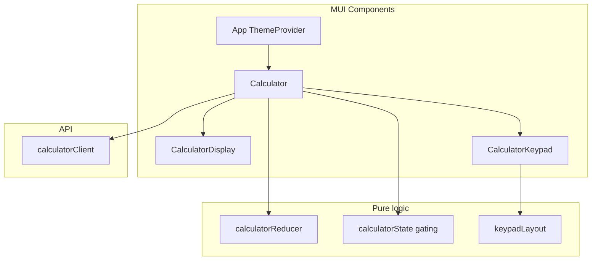

# Principal Review Refactor Plan

This document records the approved principal-review refactor plan for the Sezzle calculator take-home assignment.

**Scope interpretation (corrected):**

| Area | Action |
|------|--------|
| Rules and skills (first) | Update [`.cursor/rules/project.mdc`](../../.cursor/rules/project.mdc) and [`.cursor/skills/implement-react-frontend/SKILL.md`](../../.cursor/skills/implement-react-frontend/SKILL.md) to resolve MUI conflict |
| Frontend | Refactor to Material UI for readability, **without changing architecture/state flow/API behavior** |
| Backend | Preserve previous backend quality plan using principal-review §4 guidance (clean code + pragmatic SOLID) |
| Docs | Apply documentation-review updates in [`README.md`](../../README.md) and [`docs/AI_USAGE.md`](../AI_USAGE.md) |

**Constraint:** keep architecture stable; changes are refactoring-quality focused, not feature expansion.

---

## Phase 0 — Principal-review baseline

Capture concrete findings from [`.cursor/skills/principal-review/SKILL.md`](../../.cursor/skills/principal-review/SKILL.md) to drive refactor scope:

- Frontend readability and maintainability findings (React section)
- Backend clean code / SOLID findings (Go section)
- Must-fix list only; avoid speculative/feature additions

This memo is used as the execution checklist.

---

## Phase 1 — Governance update first (rules + skill)

### 1.1 Update project rule

**Modify:** [`.cursor/rules/project.mdc`](../../.cursor/rules/project.mdc)

- Align frontend stack section with MUI adoption for readability/accessibility
- Keep anti-overengineering constraints and assignment scope
- Keep testability, reproducibility, and command standards unchanged

### 1.2 Update frontend implementation skill

**Modify:** [`.cursor/skills/implement-react-frontend/SKILL.md`](../../.cursor/skills/implement-react-frontend/SKILL.md)

- Replace “avoid UI libraries” with guidance that MUI is allowed/expected in this repo
- Keep requirements for simple local state, API-driven calculations, and Vitest/RTL
- Keep command/validation and documentation handoff sections

---

## Phase 2 — Frontend refactor (React §5 + MUI, architecture preserved)

### 2.1 Dependencies and shell

**Modify:** [`frontend/package.json`](../../frontend/package.json)

Add:

- `@mui/material`
- `@emotion/react`
- `@emotion/styled`

**Modify:** [`frontend/src/App.tsx`](../../frontend/src/App.tsx)

- Wrap app in `ThemeProvider` + `CssBaseline`
- Minimal default theme (no custom theme object unless needed for contrast)
- Center layout with `Box` / `Stack` (no redundant page title)

**Modify:** [`frontend/src/components/Calculator.tsx`](../../frontend/src/components/Calculator.tsx)

- Replace structural HTML/CSS classes with MUI components (`Paper`, `Grid`, `Button`, `Typography`, `Alert`)
- Keep all existing behavior/state transitions/API mapping unchanged
- Preserve accessibility labels and operator selection/gating behavior

### 2.2 Component split (SRP, readable JSX)

Target structure:

```text
frontend/src/
  components/
    Calculator.tsx            # MUI-based composition
    CalculatorDisplay.tsx     # display/error/loading
    CalculatorKeypad.tsx      # button grid
    keypadLayout.ts           # declarative keypad config
    keypadButtons.ts          # button props and gating
  hooks/
    useCalculatorKeyboard.ts  # keyboard shortcuts
```

Splitting files is optional; keep same architecture (no new state management layer, no new app-level abstractions).

### 2.3 MUI mapping (skill lines 70–73, 82–83)

| UI area | MUI components |
|---------|----------------|
| Calculator shell | `Paper`, `Stack`, `Box` |
| Keypad | CSS grid + `Button` |
| Display | `Typography` |
| Error | `Alert` `severity="error"` |
| Loading | `CircularProgress` + `Typography` |
| App layout | `ThemeProvider`, `CssBaseline` |

Preserve existing behavior:

- Button gating with **selected operator** highlighted (`aria-pressed`) and other binary ops disabled in `enteringSecond`
- CE full reset; sqrt only in `resultShown`
- Empty second operand display shows `0` until user types

### 2.4 Tests

**Update:** [`frontend/src/components/Calculator.test.tsx`](../../frontend/src/components/Calculator.test.tsx)

- Queries stay role/`aria-label` based (MUI `Button` forwards `aria-label`)
- Keep tests behavior-focused (no MUI snapshot tests)

**Run:**

```bash
just test-frontend
just build-frontend
```

Coverage must remain ≥ 80% thresholds in [`frontend/vite.config.ts`](../../frontend/vite.config.ts).



---

## Phase 3 — Backend quality refactor (Go §4, architecture preserved)

Apply the previously approved backend quality direction while keeping the existing layering (`calculator`, `httpapi`, `config`):

- Improve readability and small-function boundaries in [`backend/internal/httpapi/handler.go`](../../backend/internal/httpapi/handler.go) without changing contract
- Improve maintainability in [`backend/internal/calculator/service.go`](../../backend/internal/calculator/service.go) while keeping behavior and error codes stable
- Add operation evaluator registry in [`backend/internal/calculator/operations.go`](../../backend/internal/calculator/operations.go)
- Extract request parsing in [`backend/internal/httpapi/request.go`](../../backend/internal/httpapi/request.go)
- Keep KISS and avoid unnecessary interfaces or framework-like indirection
- Extend existing table-driven tests only where refactor introduces new branches/helpers

Primary checks:

- `POST /api/v1/calculate` contract unchanged
- Existing error codes unchanged
- Coverage expectations preserved (calculator/httpapi/config)

---

## Phase 4 — Documentation review

Apply [`documentation-review`](../../.cursor/skills/documentation-review/SKILL.md) after code changes.

### 4.1 README updates ([`README.md`](../../README.md))

| Section | Change |
|---------|--------|
| Tech stack | Add Material UI + Emotion |
| Design decisions | Note why MUI was adopted for readability and skill alignment |
| Frontend behavior | Unchanged flows; mention MUI `Alert` / loading indicator |
| Assumptions | Clarify MUI adoption rationale and preserved architecture/behavior |
| Prerequisites | No change (Node already listed) |

Keep **port 3000** examples (repo truth); do not copy documentation-review template’s 8080 literals.

### 4.2 AI_USAGE ([`docs/AI_USAGE.md`](../AI_USAGE.md))

- Add **Prompt 8** — principal-review refactor (frontend MUI + backend registry)
- Update **Final validation** with post-refactor commands and results

### 4.3 Plans

- Record refactor outcome in [`FRONTEND_IMPLEMENTATION_PLAN.md`](FRONTEND_IMPLEMENTATION_PLAN.md)
- Save this plan at [`PRINCIPAL_REVIEW_REFACTOR_PLAN.md`](PRINCIPAL_REVIEW_REFACTOR_PLAN.md)

---

## Phase 5 — Verification checklist

```bash
just test-frontend
just test-backend
just build
just docker-build   # optional smoke
```

Deliverables:

1. Principal-review memo (Summary, Must fix, Nice to improve, Final recommendation)
2. Updated project rule + frontend skill (done first)
3. Refactored frontend components to MUI (architecture preserved)
4. Backend quality refactor (architecture preserved)
5. Updated README + AI_USAGE
6. All tests green, coverage thresholds met

---

## Risk summary

| Risk | Mitigation |
|------|------------|
| MUI bundle size | Acceptable for take-home; no heavy theming |
| Tests break on MUI DOM | Keep `aria-label` on every `Button` |
| Rule/skill drift | Update both `.cursor/rules` and frontend skill in same change |
| Over-customized UI | Keep default theme and simple layout |
| Refactor behavioral regressions | Preserve API contract and run full frontend/backend tests |

## Implementation outcome

| Phase | Status |
|-------|--------|
| Governance (rules + skill) | Completed |
| Frontend MUI refactor | Completed |
| Backend quality refactor | Completed |
| Documentation review | Completed |
| Verification | Completed |
